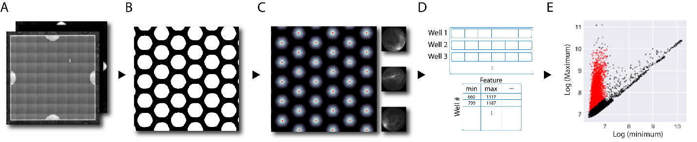

# chip-extract
This repository contains example scripts for the data extraction in [PUBLICATION LINK]. The scripts within the folder `scripts/` are the main entry points to using this repo.

Given an image of a [QuantStudio PCR 20k chip](https://www.thermofisher.com/order/catalog/product/A26316) the scripts extract all 20,000 wells individually. The individual wells are extracted first as 90x90 pixel images, then flattened to be a vector of 8100 values, and then stored as rows in a dataframe. This dataframe is saved to disk as a [feather file](https://arrow.apache.org/docs/python/feather.html) for use in downstream analysis.

The processing assumes a few important points:
1. The images are in `.tif` format.
1. The images contain **exactly** 3 dimensions (the order isn't important).
1. The images are oriented so that the fiducial mark of the chip is in the top-right corner. (the small white mark in part A of the overview image below).

See below for a graphical overview of the pipeline:



# Setup
The easiest way to run the code within this repo is to create a `conda` environment after installing `miniconda`. [See this link for `miniconda` installation instructions](https://docs.conda.io/en/latest/miniconda.html).

After installing `miniconda` and cloning this repo the environment can be created with the following command:
```
conda env create -f env.yml
```
* Ensure the above command is called from within this repo, or provide the full path to the `env.yml` file.

# Example data files
Two test files have been provided to follow the data flow of the scripts. Those files can be downloaded from the following link:

https://zenodo.org/doi/10.5281/zenodo.10402295

Download these files, place them in the folder `test_images` alongside the file `experiment_config.yml`, and edit the paths in each individual script before running.

# Running the scripts
Before running the scripts, there are some parameters that need to be set within them. See each script for a short description at the top of each file.

Once the parameters are set (the input image paths), the scripts can be run:
```shell
python scripts/extract_single_chip.py
```

# Output
The output is saved in the same location as the input images, with a folder per-image with the same name. So, the example image `test_chip_1.tif` will produce the output:
```
test_chip_1/
├── all_wells_metadata.feather
└── all_wells_raw.feather
```

The files are both [feather files](https://arrow.apache.org/docs/python/feather.html) representing data frames:
* `all_wells_metadata.feather` is set up for computing various metrics downstream
* `all_wells_raw.feather` contains the actual raw image data for each well

# Notes
Inspection of the code within the `scripts/utils` folder is encouraged. An attempt was made to document each function clearly, so that edits could be made where needed. These scripts will not work for all data, but can be made much more flexible with slight edits.